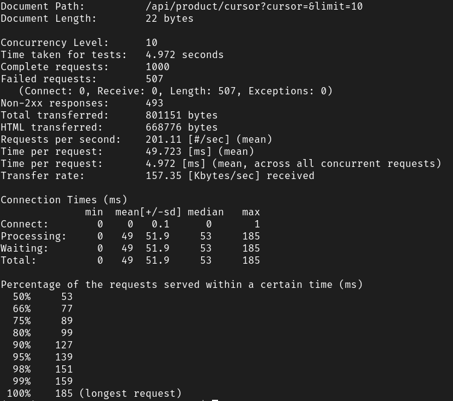
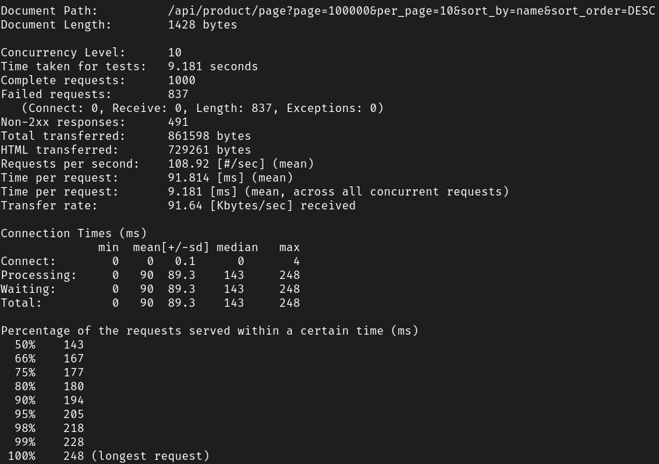

# Pagination

## Motivation
Since i know about two strategy about pagination, i want to try how to make both and knowing how much the different between one and another, in this repo i will make a comparation between:
- Pagination using page
- Pagination using cursor

## Pagination 
### Pagination Using Page
Pagination using page is popular way to paginate the request of batch data, it used a number like 1, 2, 3 to say that i need data from that page, let say we have 100 data and per page is 10, when we send request with `page = 3`, we will get data from 21 - 30, `page = 5` will get data from 41 - 50.

### Pagination Using Cursor
Litle bit different, this pagination not send `page` to the server, it send `next = this_is_cursor` as cursor for the next data we want, this cursor will used as filter `where` in database query so we can get the next data from information in `next`.

## Tech Stack

- Go
- Postgres
- pgx library
- go-chi

## How To Run This Program

1. Type `make setup` to install all needed in this go project, oh, before that you must have Golang first.
2. Create a database on postgres
3. Fill the `.env` file with your config, config consist for postgres configuration and server listener configuration.
4. Run migration by typing `make migup`, and if you want to migrate down just type `make migdown`.
5. Execute `make run` to run the application

## Todo

- [v] Pagination using page
- [v] Pagination using cursor
- [v] Create seeding data
- [v] Create benchmark

### Pagination Using Page Number
```
http://127.0.0.1:8080/api/product/page?page=100000&per_page=10&sort_by=name&sort_order=DESC
```

### Pagination Using Cursor
```
http://127.0.0.1:8080/api/product/cursor?cursor=&limit=10

```

### Create Seeding Data

Seed data can in `db/seeder/seed.lua`, i use Lua scripting language to generate a `.sql` file that contain seeder data to table when migration up.

### Create Benchmark

I use ApacheBench for load test, you can visit this page for more information [site](https://httpd.apache.org/docs/2.4/programs/ab.html), for simplicity you can type `make bench` to run benchmark using `ab` a.k.a ApacheBench, or if you want to change the parameter you can look at my Makefile.



__Load test on cursor based pagination__




__Load test on page based pagination__

## Summary

Test by yourself, on my machine the pagination using cursor is almost 2 times faster than pagination using page.
